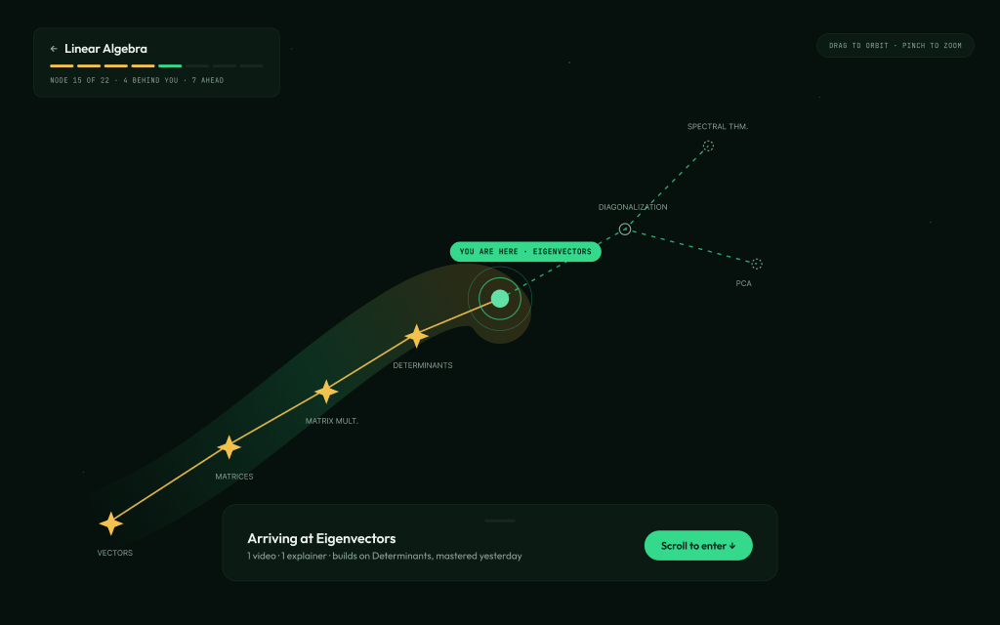

# EEF Learn

**Learn anything. See the whole map.**

EEF Learn turns any topic into a living, navigable map of the best free knowledge. AI builds the constellation; YouTube videos, blogs, community maps, and your own PDFs fill it in — every source credited. Finish a map and a real person from the [Emmanuel Eze Foundation](https://emmanuelezefoundation.org) community meets you for a 30-minute coffee chat.

> **Status: pre-alpha, building in the open.** The design and plan are complete and approved; the build is underway. Follow along or jump in.

## What it does

- **Knowledge maps** — type a topic (or upload a PDF) and get a knowledge graph of everything you need to learn, ordered by prerequisites, rendered as a constellation you can travel in 3D (with a first-class 2D accessible view).
- **Real-time content** — lessons generate as you arrive at each node: curated YouTube videos, linked articles, and AI explainers with named sources and full provenance.
- **A learning companion** — a bot that knows your progress ("You mastered Determinants yesterday — this section leans on it") and answers questions about what you're learning.
- **Community maps** — publish your map so others can learn from it; complex maps can build on existing ones, with credit and learner-controlled updates.
- **Coffee chats** — finish a map and request a 30-minute conversation, matched by hand from EEF's community of alumni and volunteers. No algorithm decides who you meet. A person does.

## Our position

We will never compete with frontier labs on generation quality. We compete on the **community graph**, **attribution lineage**, and **EEF's human network**. Every piece of content credits its sources. Every map credits the maps it builds on. Every completed journey ends with a human being.

## Stack

| Layer | Choice |
|---|---|
| Monorepo | Turborepo + pnpm |
| Web | Next.js (App Router), Tailwind, shadcn/ui, react-three-fiber |
| Mobile (v1.5) | Expo / React Native, NativeWind |
| Auth | Better Auth |
| AI service | Python FastAPI (generation pipelines, RAG, knowledge graph) |
| Database | Postgres + pgvector (Neon hosted / docker-compose local) |
| AI providers | Mock by default; OpenRouter with per-task model routing for hosted |
| Streaming chat | Vercel AI SDK |

Self-hostable with one command (`docker-compose up`), or run on the hosted stack (Vercel + Neon + Railway).

## Documents

- [`PLAN.md`](PLAN.md) — the reviewed implementation plan (milestones M0–M5)
- [`docs/designs/eef-learn-platform.md`](docs/designs/eef-learn-platform.md) — the approved platform design
- [`docs/design/BRAND.md`](docs/design/BRAND.md) — the Aurora brand system (dual-theme palette, map language, motion grammar)
- [`PRODUCT.md`](PRODUCT.md) — durable product truth
- [`TODOS.md`](TODOS.md) — scope deferred to v1.5 / v2

## About the Emmanuel Eze Foundation

EEF's mission: anyone can learn anything, and nobody should do it alone. We pair free, open-source learning tools with a human community — coffee chats, mentorship, and physical and virtual events.

## License

[MIT](LICENSE) — free to use, self-host, fork, and build on.
